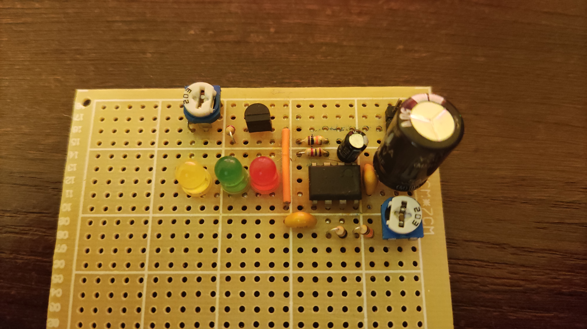
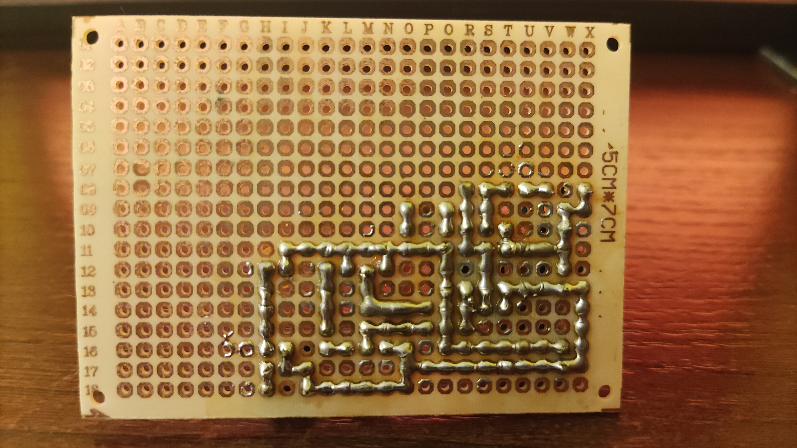

# Lutowanie

Przerzutnik typu RS - autorski projekt wykonany w całości samodzielnie w chwili wolnego czasu. Było to pierwsze ćwiczenie, którego głównym celem było zapoznanie się z lutownicą
Link do prezentacji projektu: https://youtube.com/shorts/VxUgGZ4729I?feature=share

Układ czasowy NE555 - drugi projekt, którego głównym celem było doskonalenie umiejętności elektroniczno-lutowniczych. Zadaniem układu jest miganie diodami (czerwona, zielona) z możliwością regulacji częstotliwości (regulowanie czasu rozładowywania kondensatora za pomocą potencjometru). Dioda żółta została podłączona do potencjometru znajdującego się tuż obok niej, niestety jednak podczas testów (zmniejszenie rezystancji potencjometrem) została spalona (wina zbyt małej rezystancji opornika dolutowanego do wyprowadzenia diody).
Link do prezentacj projektu: https://youtu.be/KaiS1kktG8M

###########################################################################################################

###########################################################################################################

